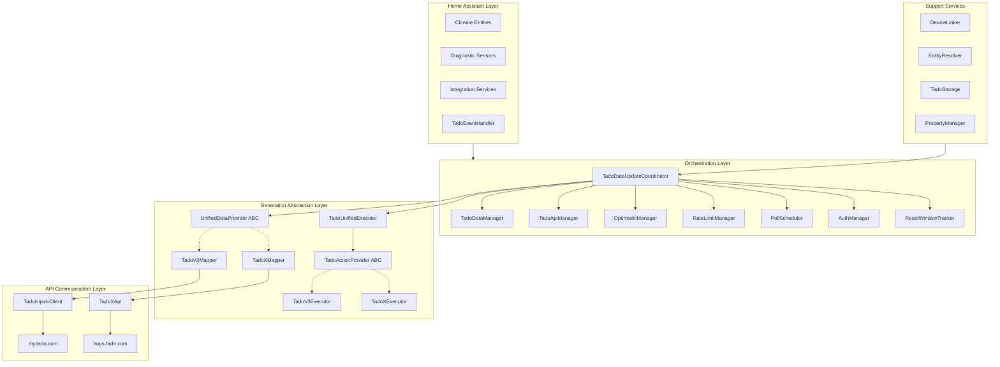

# Multi-Generation Architecture

Tado Hijack is built on a modular, generation-aware architecture. It abstracts the significant differences between Tado's classic V2/V3 hardware and the newer Tado X generation into a unified data model.

---

## 🏗️ Architectural Layers

---

## 🧠 The Orchestration Core

### `TadoDataUpdateCoordinator`
The central brain of the integration. It initializes all sub-managers and determines the hardware generation during setup. It holds the `UnifiedTadoData` which is the single source of truth for all entities.

### `TadoDataManager`
Handles the complexity of multi-track polling. It maintains separate caches for:
- **Zone States:** Current HVAC modes and temperatures.
- **Metadata:** Zone names and device lists.
- **Capabilities:** Hardware-specific features (AC modes, Temp ranges).
- **Settings:** Offsets and Away temperatures.

### `TadoApiManager`
Manages the command queue with debouncing. Commands are buffered for a configurable window (default 5s), then fused by the `CommandMerger` into a single bulk API call. Runs a background worker task for sequential execution.

### `OptimisticManager`
Patches Home Assistant state instantly on user action, before the API confirms. Stores optimistic values with a grace period (default 30s). Supports rollback on API failure. Scoped by home, zone, and device.

### `RateLimitManager`
Enforces the throttle threshold (default 20 calls). When remaining quota drops to this floor, all background polling stops instantly to preserve quota for manual actions and automations. Tracks API rate limit headers and detects throttled/rate-limited states.

### `PollScheduler`
Calculates adaptive polling intervals based on remaining quota and time until reset. Uses EMA smoothing for cost prediction and a weighted profile to prioritize performance hours over nighttime.

### `AuthManager`
Handles credential management and token refresh for the Tado cloud API session.

### `ResetWindowTracker`
Learns the user-specific quota reset time by observing reset patterns over multiple days. Provides predicted reset timestamps and confidence levels used by the PollScheduler for budget distribution.

---

## 🔄 Generation Abstraction

Tado Hijack uses a polymorphic design to handle the shift from the legacy Classic API to the new Hops API used by Tado X.

### Data Fetching: `UnifiedDataProvider`
This interface ensures that regardless of the API structure, the integration receives data in a standardized format.
- **TadoV3Mapper:** Parses Classic API responses (where temperatures are in `.celsius`).
- **TadoXMapper:** Parses Hops API responses (where temperatures are in `.value`).

### Command Execution: `TadoActionProvider`
Abstracts write operations.
- **V3 Executor:** Uses `POST /overlay` for Classic devices. Supports AC Pro and Hot Water.
- **X Executor:** Uses `POST /hops/...` endpoints. Optimized for Bridge X architecture.

---

## 🔗 Device Unification & Resolution

### `EntityResolver` & `DeviceLinker`
Two complementary utilities that bridge the gap between Tado's Cloud and Home Assistant's local registry.

**`EntityResolver`** resolves HA entity IDs to Tado zone IDs. It caches lookups, parses unique IDs, and performs deep registry scans to find zone associations — including resolving device entities (e.g. `child_lock_VA123`) back to their owning zone via serial number.

**`DeviceLinker`** (`helpers/device_linker.py`) handles device unification. It builds a cache from the HA device registry keyed by `serial_number`, matching any Tado device regardless of platform (HomeKit or Matter). When a cloud serial matches a local device, cloud-only entities are injected into that device entry.

- **V3 (HomeKit):** HomeKit always exposes Tado serial numbers, so cloud entities (Child Lock, Battery, Offset) are automatically injected into existing HomeKit device entries.
- **Tado X (Matter):** When Matter exposes the device serial (same `VA…` as the Tado cloud), the same injection mechanism applies — cloud features merge onto the Matter device. If no serial is available, features stay on separate Hijack devices, and users can manually link temperature/humidity sources via **Dynamic Source Selection** (`select.zone_temp_source` / `select.zone_humidity_source`).

### Duck Typing Strategy
To minimize generation-specific `if/else` logic, the codebase heavily utilizes Python's `getattr()` for data model access. This allows the integration to gracefully handle missing or renamed keys across Tado's various API iterations.
